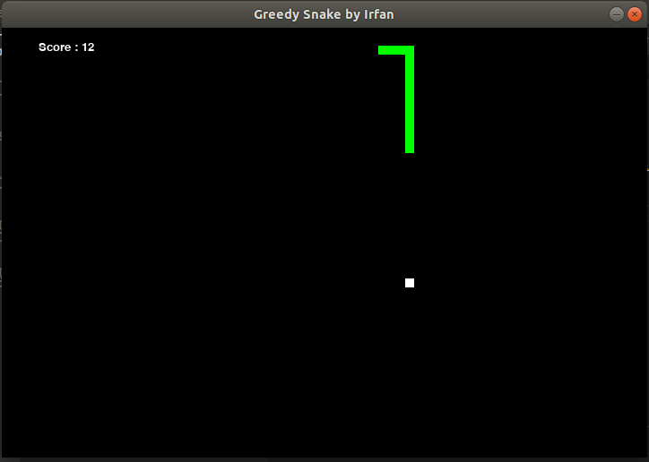

# Bot Greedy-Best Snake

## Irfan Chairurrachman

## Makassar, Indonesia

**About:**

This is bot snake using Greedy Best-First Search algorithm. The snake will choose the closest direction to the food as determined by heuristic function (in this project `def greedy(direc, pos, goal, body)`). The function calculate and estimates how close snake head with the food. So, this snake will chase the food automatically until the snake hits it's own body.

I really inspired and helped from [CS50 AI](https://cs50.harvard.edu/ai/2020/) that really helped me understanding Greedy algorithm and made me excited to implement in this snake game.

**Shortcoming:**

Because this bot estimates the closest distance between snake head and the food, the function ignores snake body, so it means body snake still counts as steps to get the food.

**Technology:**

python version: 3.7.9

module needed:

- [pygame](https://www.pygame.org/wiki/GettingStarted)
- [numpy](https://numpy.org/install/)

manual snake reference: *thanks to anyone build manual snake code*

- [snake manual](https://gist.github.com/rajatdiptabiswas/bd0aaa46e975a4da5d090b801aba0611)

(with a lot of changes)

[Github Repositori](https://github.com/IrfanChairurrachman/Bot-GreedySnake)
